# **Updates on Initial Stock-Recruit Model Results**

*Presenter:* Cole Brookson
*Date:* 2022-02-17

---

# Model

Followed the form in Peacock (2013)

$$ \text{ln}[R_{i,t}/N_{i,t-2}] = r - b_iN_{i,t-2} - cW_{a,t-1} + \theta_t + \theta_{a,t} + \epsilon_{i,t}$$

* Fit in `glmmTMB`
  * Null model: `survival ~ scale(S):population_name + 
                                (1|year/area)`
  * Alternative model: `survival ~ scale(S):population_name + 
                               scale(lice) + (1|year/area)`
* Reason for using `scale()` on the predictors is the models didn't converge without it - non-positive-definite Hessian
* Final dataset (only kept populations with > 20 stock-recruits per populations):
  * 77 populations (even/odd)
  * 1752 S-R pairs
  * 45 rivers

---
# Results

Comparison between null model and alternative model:

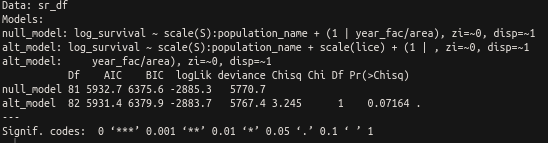

1. No clear difference between the null model and the alternative model
   * Note - cannot test the model differences without using the `scale()` in `glmmTMB` but can force them to fit `lme4` - however there was still no difference
2. **Model parameters** for the growth rate, $r$ (Intercept) = 0.19218, and the strength of the relationship betweenpink salmon survival and lice on wild juvenile salmon, $c$ = 0.09217

---

# Why is This Different Than Stephs Results

I think there are some actually very small errors in the code that introduced some problems (**I have not fully tested this**)

---

# Problem 1 - Sample size 

In the paper (and in the final dataset generated in the code), there are: 
   * 179 populations
   * 2307 S-R pairs
   * 99 rivers
  
But, I think this is actually too large of a dataset. There is code to exclude populations with <20 S-R pairs: 

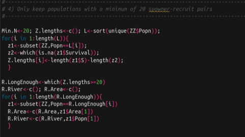

It's just that there's nowhere where the `R.LongEnough` is actually used to subset the focal dataframe 

---

# Problem 1 - Do the results change? 

So I redid all the analysis with the code and data availabe. These are the results: 

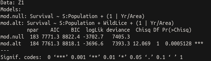
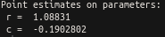

**Side note:** $c$ is reported as a positive value in the MS.

---

# Problem 1 - Do the results change? 

I then checked the results when the correct dataset (making sure the populations with <20 pairs were out). That gave: 
   * 55 populations
   * 1253 S-R pairs
   * 32 rivers

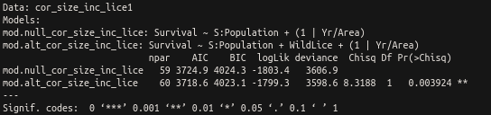
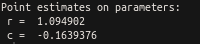

So conclusions don't change (the alternative model still improves the fit), but the value of $c$ does change (was -0.19) before. 

---

# Problem 2 - Lice covariate match-up 

Unfortunately though after this I noticed another problem with how the data for the lice covariate was being matched up. Essentially, somehow this "+1" made it into the code: 
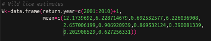
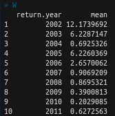

So you'll notice this now goes from 2002 - 2011, but this should be 2001-2010. Particularly the highest year (2001) is what matters I suspect.

---
# Problem 2 - Re-doing Analysis with proper lice covariate

So I re-did the analysis with both versions of the dataset (the longer and the shorter on). Here is with the longer:

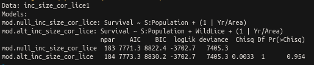
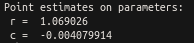

Here we see that actually the null model actually has a slightly lower AIC. The estimate for $r$ stays relatively consistent, but for $c$ it goes to almost zero. 

---
# Problem 2 - Re-doing Analysis with proper lice covariate

I tried this also with the dataset of the correct size:

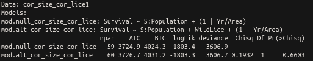
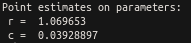

So this is similar - the null model is marginally better AIC-wise, and $c$ is close to zero. 

---
# Obviously I could be missing something...

...but this is what I have been able to figure out so far. **Unsure where to go from here...**
