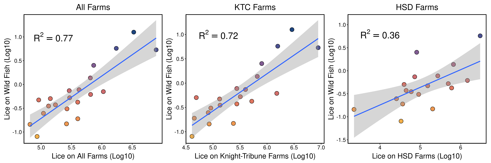

---
header-includes:
output:
  markdown::pdf_document:
      keep_tex: yes
---

# Update on BATI Contract
### **Cole Brookson**
### **09 June 2022**

## Data Acquisition

So far, we have successfully attained all the data required to run analyses on coho and pink salmon. The pink data took quite some time, but we finally received it at the beginning of June from Pieter Van Will at DFO. This means that we have everything in hand to move forward with the stock-recruit analysis for pink and coho. 

The chum data we are still waiting on from Pieter, and hopefully that will come in soon, but it isn't looking likely that we will receive it before July. 

## Analysis

We have already completed the analysis examining the correlation between lice on farmed fish and on wild fish. We were able to use the data from Salmon Coast Field Station on numbers of lice on wild fish, along with the data on the number of lice on farmed fish to see how those two patterns relate. 

Given that some farms likely contribute far more lice to the number of lice on wild juvenile salmon, we compared three different groupings of the farms. We looked at the relationship of lice on wild juveniles to a) the number of lice on all farms, b) the number of lice on the farms in the Knight-Tribune corridor, and c) the number of lice on three focal farms - Humphrey, Sergeant, and Doctors. 

We show that the number of lice on wild juveniles is best predicted by the number of lice on all farms. 

**Figure 1:** A comparison of the relationship between the number of lice on wild salmon (on a log10 scale), and the number of lice on the three sets of farm comparisons (also a log10 scale). 

Given these results, we will be able to use the number of lice on farmed fish as an estimate of the lice on wild fish in our main stock-recruit model. With the data for pink salmon now in hand, this is possible. 

## Next Steps

We are currently in the midst of developing a version of the stock-recruit models to present an initial set of results for to BATI. The specific next steps of that are: 

1. Replicate the previous frequentist approach to provide an initial set of analysis to report to BATI
2. Continue pursuing the chum data from the department of Fisheries & Oceans
3. Fit the stock-recruit models to data using Bayesian methods to better quantify uncertainty. 

These next steps mean that we are slightly behind (~2 weeks) the schedule outlined in the initial contract schedule, but progress will now be faster given that all pink salmon data are in hand. 

